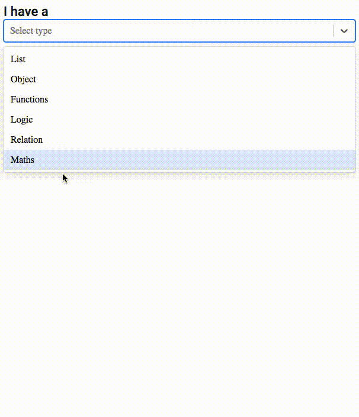

# Learn ramda, the interactive way

## Why

Ramda might be intimidating for newcomers, so I wanted to create a tool to help!

## Thanks

- Kudos to [Sarah Drasner](https://github.com/sdras) for inspire me with: https://sdras.github.io/array-explorer
- Kudos to [Stefano Vozza](https://github.com/svozza) for creating all the documentation! https://github.com/ramda/ramda/wiki/What-Function-Should-I-Use

## Want to run it locally?

This project was bootstrapped with [Create React App](https://github.com/facebook/create-react-app). You can learn more in their [documentation](https://facebook.github.io/create-react-app/docs/getting-started).

#### `npm start`

Runs the app in the development mode. 
Open [http://localhost:3000](http://localhost:3000) to view it in the browser.

The page will reload if you make edits. 
You will also see any lint errors in the console.