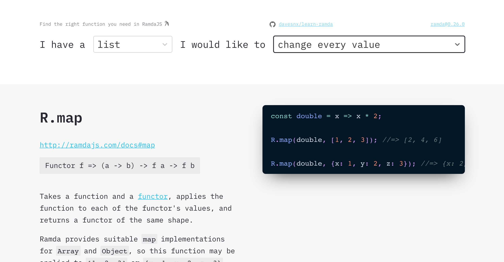

# 🐏 Learn ramda, the interactive way

Those recent years Functional Programming paradigms became more present in the JavaScript ecosystem. From the first functional approach I saw from underscore library, many years passed, and we are now at a place where many of us see the benefits in writing code this way and immutability in mind.

Still, all the functional jargon can be a barrier for beginners. Not only individuals that want to get their heads into FP, but also teams that have use-cases of complex data manipulation and don't see the benefit from using an FP library.

When I was digging into ramda, I found the [Ramda documentation](http://ramdajs.com/docs/) has a list of all the methods and some crazy examples in addition to a more helpful a wiki resource: [What-Function-Should-I-Use](https://github.com/ramda/ramda/wiki/What-Function-Should-I-Use) that I still use from time to time.

So, I decided to help and create a little UI to interactively find the method that works for you. Hope you enjoy it!

> If you still are lost with the FP glossary I would recommend taking a look at [hemanth/functional-programming-jargon](https://github.com/hemanth/functional-programming-jargon)

## Thanks

- Many thanks to **[Josep Martins](https://josepmartins.com)** for designing the UI & teach me how.
- Kudos to [Sarah Drasner (**@sdras**)](https://github.com/sdras) for inspiring me with: https://sdras.github.io/array-explorer
- Kudos to [Stefano Vozza (**@svozza**)](https://github.com/svozza) for creating all the documentation https://github.com/ramda/ramda/wiki/What-Function-Should-I-Use

## I need some help

I want to improve the example code snippets. Right now, I got all of them from ramda jsdoc's source code, the same ones in [ramdajs.com/docs](https://ramdajs.com/docs).

Many times I don't find them useful, so I would love your help on improve it.
Could [suggest](https://github.com/davesnx/learn-ramda/issues/new) some new code examples for some methods and hopefully someday we could improve the official docs!

## Want to run it locally?

This project was bootstrapped with [Create React App](https://github.com/facebook/create-react-app). You can learn more in their [documentation](https://facebook.github.io/create-react-app/docs/getting-started).

#### `npm start`

Runs the app in the development mode. 
Open [http://localhost:3000](http://localhost:3000) to view it in the browser.

The page will reload if you make edits. 
You will also see any lint errors in the console.

[![Build status][ci-image] ][ci-url]
[![semantic-release][semantic-image] ][semantic-url]
[![js-standard-style][standard-image]][standard-url]

[ci-image]: https://travis-ci.org/davesnx/learn-ramda.svg?branch=master
[ci-url]: https://travis-ci.org/davesnx/learn-ramda
[semantic-image]: https://img.shields.io/badge/%20%20%F0%9F%93%A6%F0%9F%9A%80-semantic--release-e10079.svg
[semantic-url]: https://github.com/semantic-release/semantic-release
[standard-image]: https://img.shields.io/badge/code%20style-standard-brightgreen.svg
[standard-url]: http://standardjs.com/
